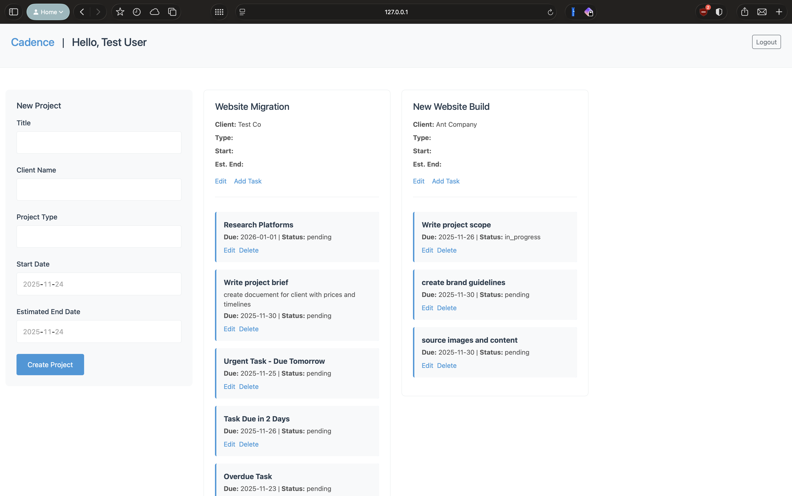
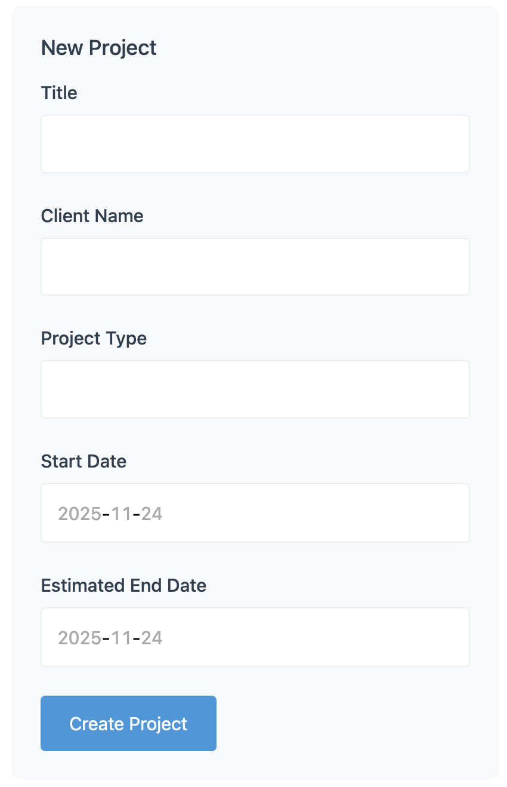
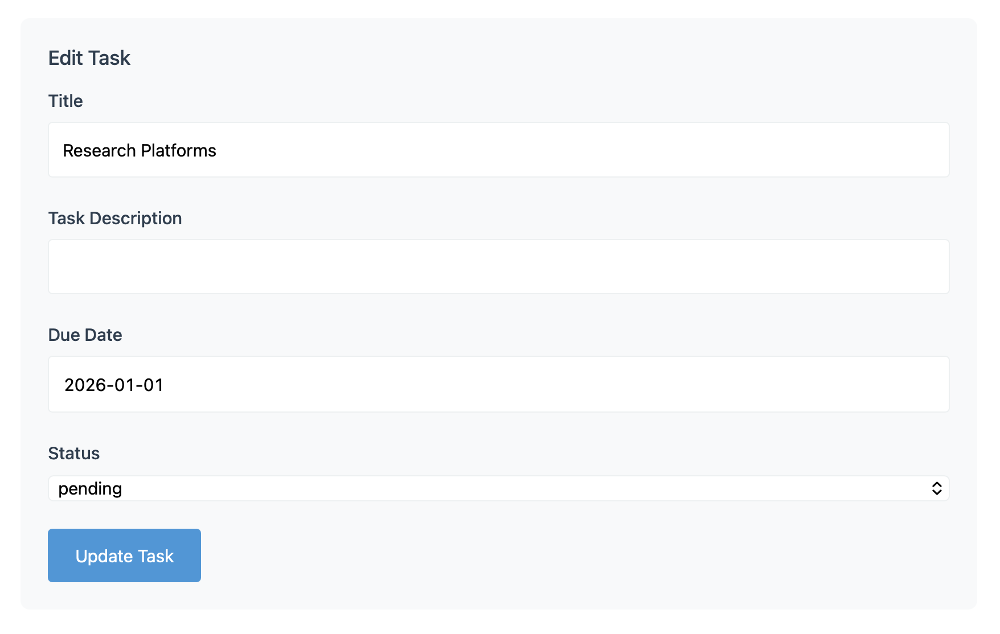

# Cadence - Task Management & Deadline Tracking

> **Status:** Proof of Concept in Active Development
>
> A Ruby on Rails task management application designed for freelancers to organize projects, track deadlines, and receive automated notifications. Built as a comprehensive portfolio project demonstrating full-stack Rails development, background job processing, production deployment, and systematic problem-solving.

## 🚀 [Try the Live Demo](https://cadence-app-pnwv.onrender.com)

**Test Credentials:**
- Email: `test@testemail.com`
- Password: `password123`

> **Note:** Hosted on Render's free tier - first visit may take 30-60 seconds to wake up.

## What's Built (Current Features)

- **User Authentication** - Secure signup/login via Devise with proper authorization
- **Project & Task Management** - Full CRUD operations with nested routing (projects contain tasks)
- **Status Tracking** - Tasks support pending, in_progress, and completed states
- **Responsive Dashboard** - Card-based layout showing all projects and their tasks at a glance
- **Automated Deadline Notifications** - Email alerts for tasks due tomorrow or in two days
- **Background Job Processing** - Sidekiq handles email delivery asynchronously
- **Scheduled Jobs** - Render Cron Job checks deadlines every hour
- **Notification Preferences** - Users can enable/disable email and in-app notifications (UI for in-app display coming next)

## Technical Stack

- **Framework:** Ruby on Rails 8.1.1
- **Database:** PostgreSQL (production), SQLite (development)
- **Authentication:** Devise
- **Background Jobs:** Sidekiq with Redis
- **Email:** Mailtrap SMTP (for testing notifications without spamming real inboxes)
- **Deployment:** Render (web service + cron job + PostgreSQL)
- **Frontend:** ERB templates, Turbo, Bootstrap 5
- **Job Scheduling:** Render Cron Jobs (runs `CheckDeadlinesJob` hourly at minute 12)

## Architecture Decisions

**Why Sidekiq?**
Email delivery can be slow and unreliable. Sidekiq processes emails asynchronously so users don't wait for SMTP responses during page loads. If an email fails, Sidekiq automatically retries with exponential backoff.

**Why Render Cron Jobs?**
Rails has several scheduling options (`whenever`, Solid Queue, `sidekiq-scheduler`), but they all require a persistent process running 24/7. Render's free tier spins down after inactivity, so a separate cron job service ($7/month) reliably triggers deadline checks every hour without keeping the main app awake.

**Why PostgreSQL?**
The data model (Users → Projects → Tasks → Notifications) is inherently relational. Foreign keys enforce referential integrity, and cascade deletes (`dependent: :destroy`) keep the database clean when tasks are deleted.

## Screenshots 

### Dashboard


### New Project Form


### Edit Task Form


## Roadmap (Planned Features)

**Next Up:**
- **In-App Notification UI** - Bell icon dropdown showing recent notifications with read/unread status
- **ActionCable Integration** - Real-time dashboard updates via WebSockets (notifications appear without refresh)
- **RSpec Test Suite** - Comprehensive tests for models, jobs, and controllers

**Future Iterations:**
- **Priority Levels** - High/medium/low priority tasks with adjusted notification timing
- **Task Archiving** - Soft delete with archive/restore functionality
- **Modal Forms** - Replace separate form pages with inline modals
- **Recurring Tasks** - Support for daily/weekly/monthly repeating tasks
- **Analytics Dashboard** - Completion rates, deadline patterns, project timelines

## Local Development Setup

### Prerequisites
- Ruby 3.4.7
- Rails 8.1.1
- PostgreSQL
- Redis (for Sidekiq)

### Installation
```bash
# Clone repository
git clone https://github.com/n4ika/cadence-app
cd cadence-app

# Install dependencies
bundle install
yarn install

# Setup database
rails db:create db:migrate db:seed

# Start Redis (separate terminal)
redis-server

# Start Sidekiq (separate terminal)
bundle exec sidekiq

# Start Rails server
rails server
```

Visit `http://localhost:3000` and use the test account credentials above.

## Real Problems, Real Solutions

**Challenge:** Project edit route randomly returned 404 errors in production  
**Root Cause:** Rails 8.1.1 had a bug where method names (`set_project`, `authorize_project!`) collided between `ProjectsController` and `TasksController`. After visiting a task route, subsequent project routes would erroneously trigger TasksController methods.  
**Solution:** Renamed TasksController methods to `set_task_project` and `authorize_task_project!` to avoid namespace collision. Also consolidated duplicate `resources :projects` definitions in routes.rb that were causing routing ambiguity.

**Challenge:** Delete task button showed 404 instead of confirmation dialog  
**Root Cause:** Rails 7+ deprecated `method: :delete` syntax in favor of Turbo-specific `data: { turbo_method: :delete }`.  
**Solution:** Updated link helper syntax and added `dependent: :destroy` to Task model's `has_many :notifications` association to handle cascade deletes properly.

**Challenge:** Notifications triggered for completed tasks  
**Root Cause:** `CheckDeadlinesJob` queried all tasks by due date without filtering status.  
**Solution:** Added `.where(status: ['pending', 'in_progress'])` to queries to exclude completed tasks from notification logic.

**Challenge:** Production emails failing silently  
**Root Cause:** Missing SMTP environment variables (`SMTP_USERNAME`, `SMTP_PASSWORD`, etc.) in Render production environment.  
**Solution:** Configured Mailtrap credentials as environment variables and updated `production.rb` to use `ENV[]` lookups instead of hardcoded values.

## What This Project Demonstrates

- Full-stack Rails MVC architecture with proper separation of concerns
- Background job processing and asynchronous task handling
- Production deployment with environment-specific configuration
- RESTful routing with nested resources
- ActiveRecord associations and database modeling
- User authentication and authorization patterns
- Debugging complex issues in production environments
- Modern Rails 8 conventions (Turbo, Solid Queue, Propshaft)

## Known Limitations

- In-app notifications are created in the database but not yet displayed to users (UI coming next)
- Notification timing is date-based only (no time-of-day support yet)
- Cron job cost: ~$7/month on Render (free tier doesn't support persistent background workers)

---

**Built by Naïka** | [GitHub](https://github.com/n4ika) | [LinkedIn](https://www.linkedin.com/in/naika-estriplet/) | naika.c.estriplet@gmail.com
